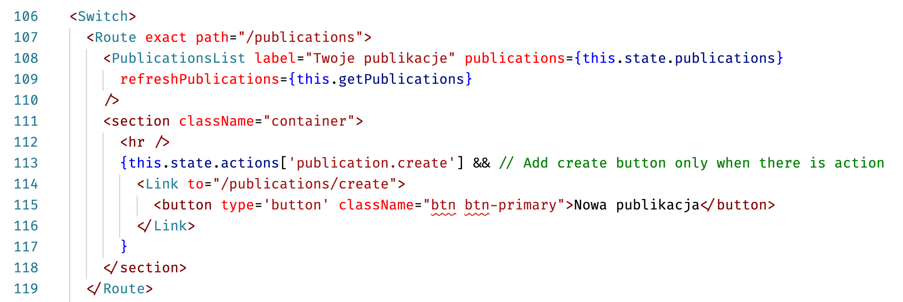
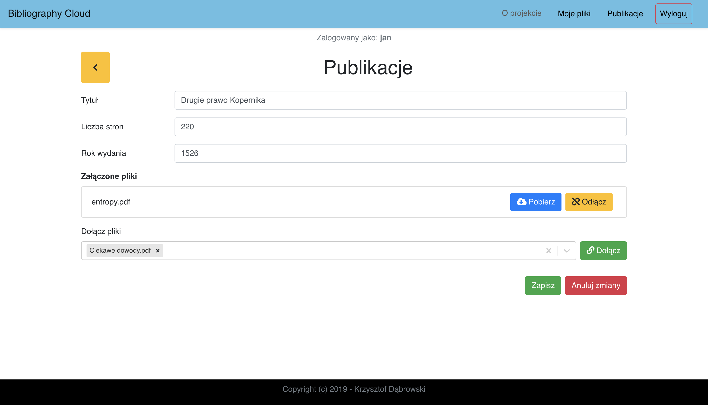
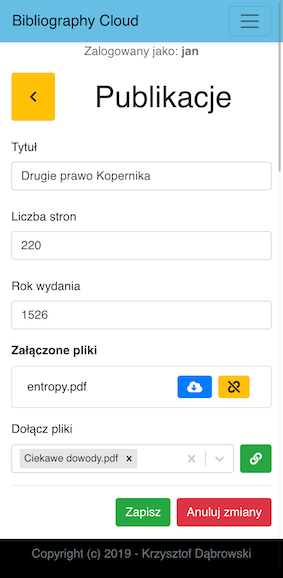

# Projekt na Programowanie aplikacji mobilnych i webowych <!-- omit in toc -->

Realizacja kolejnych etapów projektów laboratoryjnych.

## Cel projektu

Napisanie aplikacji do zarządzania źródłami w pracach naukowych.

## Spis treści

- [Cel projektu](#cel-projektu)
- [Spis treści](#spis-treści)
- [Etap 1 - Formularz rejestracyjny](#etap-1---formularz-rejestracyjny)
  - [Istotne elementy](#istotne-elementy)
  - [Uruchomienie Formularza](#uruchomienie-formularza)
    - [Web deployment](#web-deployment)
    - [Docker](#docker)
    - [Docker-compose](#docker-compose)
  - [Opis plików](#opis-plików)
    - [Pliki projektu](#pliki-projektu)
    - [Pliki konfiguracji (serwer)](#pliki-konfiguracji-serwer)
  - [Zakończenie etapu](#zakończenie-etapu)
- [Etap 2 - Logowanie i przechowywanie plików](#etap-2---logowanie-i-przechowywanie-plików)
  - [Uruchomienie projektu](#uruchomienie-projektu)
  - [Istotne elementy](#istotne-elementy-1)
  - [Projekt systemu](#projekt-systemu)
  - [Rest API](#rest-api)
  - [Logowanie](#logowanie)
- [Etap 3 - Publikacje, RESTFull i klient mobilny](#etap-3---publikacje-restfull-i-klient-mobilny)
  - [Szyfrowanie połączenia](#szyfrowanie-połączenia)
  - [Usługa sieciowa](#usługa-sieciowa)
  - [Klient webowy](#klient-webowy)
    - [Konfiguracja](#konfiguracja)
    - [Działanie](#działanie)
    - [Responsywność](#responsywność)
- [Przydatne materiały](#przydatne-materiały)

## Etap 1 - Formularz rejestracyjny

Opracowanie formularza rejestracyjnego dla nowych użytkowników. Formularz musi pozwalać na **walidowanie wszystkich pól na bieżąco**. Kod JavaScript, HTML i CSS muszą być od siebie **odseparowane**. Komunikaty błędów muszą być tworzone dynamicznie przez kod JS. Polę login użytkownika będzie sprawdzane pod kątem dostępności **asynchronicznie**. Dane do rejestracji będą przesyłane do na zewnętrzny serwer. Kod HTML i CSS musi przechodzić walidację.

### Istotne elementy

* czy kod HTML posiada puste węzły na komunikaty (źle, powinny być one dodawane dynamicznie),
* czy wykorzystywane są elementy HTML5 zamiast generycznych, np. `
`, ``,
* jak analizowana jest odpowiedź o dostępności loginu (czy sprawdzany tylko tekst odpowiedzi, czy też kod statusu).

### Uruchomienie Formularza

Strona wymaga **połączenia z Internetem**, ponieważ ładuje biblioteki z CDN oraz sprawdza poprawność loginu na zewnętrznym serwerze.

#### Web deployment

Stan projektu po pierwszym kroku milowym można zobaczyć pod [adresem](https://bibliography-cloud.azurewebsites.net).

Projekt jest hostowany na platformie _Microsoft Azure_ na **darmowym** poziomie - F1.  
:exclamation: Jeśli aplikacja nie była ostatnio uruchamiana start może zająć nawet **5 minut**. :exclamation:

#### Docker

Zbudowanie obrazu z pliku [Dockerfile](./Dockerfile).  
`docker build -t biblio-cloud .`

Uruchomienie kontenera.  
`run --rm  --name nginx -p 8080:80 -it biblio-cloud`

Następnie strona powinna być dostępna pod adresem [http://localhost:8080](http://localhost:8080/).

#### Docker-compose

Alternatywnie można uruchomić projekt poleceniem `docker-compose up`.

Następnie strona powinna być dostępna pod adresem [http://localhost:8080](http://localhost:8080/).

### Opis plików

Informacja o plikach składających się na projekt.

#### Pliki projektu

- **login.html** - Struktura strony logowania
- **styles/login.css** - Wygląd strony logowania
- **img/** - Obrazy znajdujące się na stronie
- **scripts/script.js** - Skrypt bezpośrednio związany z ekranem logowania
- **scripts/utils.js** - Przydatne funkcje nie będące bezpośrednio związane z projektem
- **scripts/validateExtensions.js** - Dodatkowe funkcje i walidatory związane z biblioteką _validate.js_

#### Pliki konfiguracji (serwer)

- **nginx.conf** - Konfiguracja serwera _Nginx_
- **Dockerfile** - Opis jak zbudować kontener serwujący stronę

### Zakończenie etapu

Projekt w stanie bezpośrednio po tym etapie można znaleźć w zakładce [release](https://github.com/SiwyKrzysiek/bibliography-cloud/releases/tag/v1.0).

## Etap 2 - Logowanie i przechowywanie plików

Opracowanie modułu służącego do bezpiecznego logowania i wylogowywania użytkownika. Moduł logowania otrzymuje od użytkownika hasło i login – w przypadku poprawnych danych generowany jest **identyfikator sesji**. Dane sesyjne przechowywane są w bazie danych **Redis**. Należy opracować formularz pozwalający na przechowywanie przez użytkownika plików **PDF** w systemie. Pliki PDF powinny być dostępne do pobrania i serwowane przez **bezstanową aplikację**. Należy wykorzystać **JWT** z krótką datą ważności.

### Uruchomienie projektu

Stan projektu po tym etapie można znaleźć w zakładce [release](https://github.com/SiwyKrzysiek/bibliography-cloud/releases/tag/Milestone2).

By uruchomić projekt należy wykonać `docker-compose up` w głównym katalogu projektu.  
Domyślnie projekt będzie dostępny pod adresem [http://localhost:8080](http://localhost:8080).

### Istotne elementy

- czy w ciasteczku generowany jest identyfikator sesji czy bezterminowy JWT (to drugie nie pozwala wylogować),
- czy przy wylogowaniu usuwane są wpisy z _Redis_,
- czy w formularzu jest `enctype=multipart/form-data`
- czy aplikacja serwująca dostęp do pliku korzysta z sesji (czy innych informacji poza tymi w żetonie) - jeżeli tak, to źle,
- czy żeton do pobrania ma krótki czas ważności (kilka minut)

### Projekt systemu

System będzie podzielony na 3 główne komponenty.

Pierwszy z nich będzie rozbudowaniem aplikacji we _Falsk_ z etapu 1. Jego zdaniem jest serwowanie stron internetowych i bezpośrednia komunikacja z użytkownikiem.

Do przechowywania danych sesyjnych oraz bazy użytkowników wykorzystana zostanie baza nosql _Redis_.

Do obsługi plików wykorzystana zostanie oddzielna usługa typu REST.

### Rest API

Dokumentacja API jest opisana w pliku [restAPI.yml](./doc/resAPI.yml). Dzięki wykorzystaniu usługi Swagger łatwo można je [zobaczyć](https://app.swaggerhub.com/apis-docs/oakbit/biblography-cloud/1.0.0).

Zarządzanie plikami użytkownika jest realizowane przez **oddzielny serwer**.

Serwer jest napisany w języku Java przy pomocy biblioteki _spring_.
Odpowiada on za przechowywanie plików użytkownika. Komunikacja z nim jest możliwa tylko
przy podaniu tokenu **JWT** generowanego dynamicznie przez serwer we _Flasku_.

Tokeny mają **krótki czas ważności** i są przydzielane bezpośrednio przy podjęciu akcji przez użytkownika. Odpowiednie ścieżki na serwerze _web_ generują tokeny i zwracają **przekierowanie z zapisanym tokenem**

### Logowanie

Jest kilka kont użytkownika wpisanych na stałe do bazy

- **Login:** jan **hasło:** AAA
- **Login:** zupan **hasło:** gros
- **Login:** Atrox **hasło:** password

Moduł kreacji kont aktualnie **nie działa**.

Stan zalogowania oraz dane związane z sesją są trzymane w bazie _Redis_.
Po wylogowaniu wpisy z bazy są kasowane. Na tej podstawie odbywa się dalsze uwierzytelnianie użytkownika.
Użytkownik dostaje jedynie ciastko z **id sesji**.

## Etap 3 - Publikacje, RESTFull i klient mobilny

Celem etapu jest przygotowanie usługi sieciowej pozwalającej na przechowywanie i modyfikację pozycji bibliograficznych. Usługa sieciowa powinna zwracać powiązane elementy zgodnie z **HATEOAS**.  
Do aplikacji mają powstać **dwie aplikacje** klienckie. Jedna ma być rozszerzeniem aplikacji webowej, a druga może być aplikacją mobilną, konsolową lub biurkową. Klient powinien dostosowywać swój interface do danych zawartych w HATEOAS.

Usługa sieciowa musi pozwalać na:

- dodawanie pozycji bibliograficznej,
- listowanie pozycji bibliograficznych,
- usuwaniu pozycji bibliograficznych,
- podpinanie i odpinanie plików przy pozycji bibliograficznej,
- dodawanie, pobieranie i usuwanie plików.

### Szyfrowanie połączenia

Dodatkowo został dodany serwer Nginx pośredniczący w komunikacji z aplikacjami. Dzięki temu możliwe jest połączenie się przez **protokół https**.  
Konfiguracja serwera znajduje się w pliku [nginx.conf](./nginx.conf).

### Usługa sieciowa

Na potrzeby zarządzania publikacjami została napisana usługa sieciowa zgodnie ze stylem REST i uwzględnieniem HATEOAS.

[Dokumentacja interfejsu](https://app.swaggerhub.com/apis/oakbit/bibliography-cloud-publications/1.0.0) została opisana przy pomocy Open API.

Serwer obsługujący usługę sieciową został napisany przy pomocy frameworka Spring. Dane publikacji są przechowywanie w basie SQL H2.  
Kod źródłowy serwera znajduje się w katalogu [publications](./publications).

Usługa generuje **odpowiednie kody HTTP** oraz wysyła metadane przy pomocy **json+hal**.

Działanie samej usługi sieciowej można obserwować przy pomocy [kolekcji gotowych zapytań HTTP](https://documenter.getpostman.com/view/6368494/SWLe8ToM). Kolekcja została utworzona z myślą o aplikacji Postman i programie `curl`. Zapytania związane z tym krokiem milowym znajdują się w **katalogu Publications**.

### Klient webowy

W celu urozmaicenia projektu i poznania nowych technologi zdecydowałem się na renderowanie po stronie klienta i wykorzystanie frameworka **React**.

Główne pliki klienta można znaleźć w katalogu [components](./app/react-publications/src/components).

#### Konfiguracja

Połączenie serwera Flask z elementem w React nie było łatwe.   
Projekt React został utworzony w katalogu [react-publications](./react-publications) przy pomocy skryptu [create-react-app](https://github.com/facebook/create-react-app). Następnie została wyizolowana konfiguracja tworzenia projektu poleceniem `npm reject`.

Dzięki edycji plików [webpack.config.js](./react-publications/config/webpack.config.js), [paths.js](react-publications/config/paths.js) i [package.json](./react-publications/package.json) miejsce tworzenia plików wynikowych przez _webpack_ zostało zmienione na katalogi `static/react/publications` i `templates` w aplikacji Flask.

Dodatkowo połączenie aplikacji z szablonami Flaks (templates) wymagało ręcznej zmiany w [skrypcie budującym](./react-publications/scripts/build.js). Ponieważ _webpack_ dopisuje tag `<script>` na koniec pliku nie znajdował się on w bloku `` i nie był częścią strony. Żeby to naprawić skrypt budujący wykonuje dodatkowy krok ręcznie przenoszący zamknięcie bloku na koniec pliku.

Zbudowanie komponentu React można wykonać poleceniem `npm run buld`.

#### Działanie

Klient wykorzystuje asynchroniczne zapytania HTTP w celu pobrania danych z usług całej aplikacji. Jedyne dane, jakie dostaje bezpośrednio to adresy końcówek (endpoints).

Możliwe **akcje są ustalane dynamicznie** na podstawie danych HATEOAS.

Przykład tworzenia guzika dodawania publikacji:

Interfejs pozwala na pracę w trybie edycji dzięki czemu można łatwo anulować niechciane zmiany.

#### Responsywność

Cały klient webowy był tworzony z myślą wsparciu urządzeń mobilnych. Aplikacja webowa w wersji na telefon jest **głównym klientem na urządzenia przenośne**.

Dzięki zastosowaniu biblioteki Bootstrap oraz własnych CSS media query aplikacja wygląda dobrze za równo na dużych jak i małych ekranach.

Przykład trybu edycji publikacji na telefonie:

----------------------

## Przydatne materiały

- [Pozbywanie się Callback Hell](https://www.nafrontendzie.pl/jak-pozbyc-sie-callback-hell)
- [Czysty kod js](https://github.com/ryanmcdermott/clean-code-javascript)
- [Testy i mockowanie AJAXa](https://www.nafrontendzie.pl/jquery-deffered-oraz-promise-pigulce)
- [Kurs Webpack 2](https://www.youtube.com/watch?v=8vnkM8JgjpU&list=PL55RiY5tL51rcCnrOrZixuOsZhAHHy6os&index=4)
- [Integracja Flask + Webpack](https://codeburst.io/creating-a-full-stack-web-application-with-python-npm-webpack-and-react-8925800503d9)
- [Kody odpowiedzi HTTP](https://developer.mozilla.org/en-US/docs/Web/HTTP/Status)
