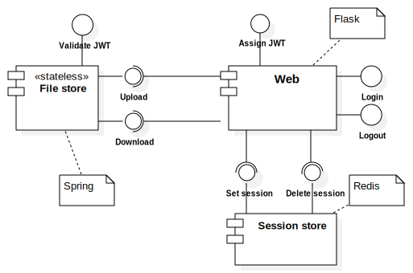

# Projekt na Programowanie aplikacji mobilnych i webowych <!-- omit in toc -->

Realizacja kolejnych etapów projektów laboratoryjnych.

Aktualny stan projektu można zobaczyć pod [adresem](https://bibliography-cloud.azurewebsites.net).

Projekt jest hostowany na platformie _Microsoft Azure_ na **darmowym** poziomie - F1.  
:exclamation: Jeśli aplikacja nie była ostatnio uruchamiana start może zająć nawet **5 minut**. :exclamation:

## Cel projektu

Napisanie aplikacji do zarządzania źródłami w pracach naukowych.

## Spis treści

- [Cel projektu](#cel-projektu)
- [Spis treści](#spis-treści)
- [Etap 1 - Formularz rejestracyjny](#etap-1---formularz-rejestracyjny)
  - [Istotne elementy](#istotne-elementy)
  - [Uruchomienie Formularza](#uruchomienie-formularza)
    - [Docker](#docker)
    - [Docker-compose](#docker-compose)
  - [Opis plików](#opis-plików)
    - [Pliki projektu](#pliki-projektu)
    - [Pliki konfiguracji (serwer)](#pliki-konfiguracji-serwer)
  - [Zakończenie etapu](#zakończenie-etapu)
- [Etap 2 - Logowanie i przechowywanie plików](#etap-2---logowanie-i-przechowywanie-plików)
  - [Istotne elementy](#istotne-elementy-1)
  - [Projekt systemu](#projekt-systemu)
  - [Rest API](#rest-api)
- [Przydatne materiały](#przydatne-materiały)

## Etap 1 - Formularz rejestracyjny

Opracowanie formularza rejestracyjnego dla nowych użytkowników. Formularz musi pozwalać na **walidowanie wszystkich pól na bieżąco**. Kod JavaScript, HTML i CSS muszą być od siebie **odseparowane**. Komunikaty błędów muszą być tworzone dynamicznie przez kod JS. Polę login użytkownika będzie sprawdzane pod kątem dostępności **asynchronicznie**. Dane do rejestracji będą przesyłane do na zewnętrzny serwer. Kod HTML i CSS musi przechodzić walidację.

### Istotne elementy

* czy kod HTML posiada puste węzły na komunikaty (źle, powinny być one dodawane dynamicznie),
* czy wykorzystywane są elementy HTML5 zamiast generycznych, np. `
`, ``,
* jak analizowana jest odpowiedź o dostępności loginu (czy sprawdzany tylko tekst odpowiedzi, czy też kod statusu).

### Uruchomienie Formularza

Strona wymaga **połączenia z Internetem**, ponieważ ładuje biblioteki z CDN oraz sprawdza poprawność loginu na zewnętrznym serwerze.

#### Docker

Zbudowanie obrazu z pliku [Dockerfile](./Dockerfile).  
`docker build -t biblio-cloud .`

Uruchomienie kontenera.  
`run --rm  --name nginx -p 8080:80 -it biblio-cloud`

Następnie strona powinna być dostępna pod adresem [http://localhost:8080](http://localhost:8080/).

#### Docker-compose

Alternatywnie można uruchomić projekt poleceniem `docker-compose up`.

Następnie strona powinna być dostępna pod adresem [http://localhost:8080](http://localhost:8080/).

### Opis plików

Informacja o plikach składających się na projekt.

#### Pliki projektu

* **login.html** - Struktura strony logowania
* **styles/login.css** - Wygląd strony logowania
* **img/** - Obrazy znajdujące się na stronie
* **scripts/script.js** - Skrypt bezpośrednio związany z ekranem logowania
* **scripts/utils.js** - Przydatne funkcje nie będące bezpośrednio związane z projektem
* **scripts/validateExtensions.js** - Dodatkowe funkcje i walidatory związane z biblioteką _validate.js_

#### Pliki konfiguracji (serwer)

* **nginx.conf** - Konfiguracja serwera _Nginx_
* **Dockerfile** - Opis jak zbudować kontener serwujący stronę

### Zakończenie etapu

Projekt w stanie bezpośrednio po tym etapie można znaleźć w zakładce [release](https://github.com/SiwyKrzysiek/bibliography-cloud/releases/tag/v1.0).

## Etap 2 - Logowanie i przechowywanie plików

Opracowanie modułu służącego do bezpiecznego logowania i wylogowywania użytkownika. Moduł logowania otrzymuje od użytkownika hasło i login – w przypadku poprawnych danych generowany jest **identyfikator sesji**. Dane sesyjne przechowywane są w bazie danych **Redis**. Należy opracować formularz pozwalający na przechowywanie przez użytkownika plików **PDF** w systemie. Pliki PDF powinny być dostępne do pobrania i serwowane przez **bezstanową aplikację**. Należy wykorzystać **JWT** z krótką datą ważności.

### Istotne elementy

- czy w ciasteczku generowany jest identyfikator sesji czy bezterminowy JWT (to drugie nie pozwala wylogować),
- czy przy wylogowaniu usuwane są wpisy z _Redis_,
- czy w formularzu jest `enctype=multipart/form-data`
- czy aplikacja serwująca dostęp do pliku korzysta z sesji (czy innych informacji poza tymi w żetonie) - jeżeli tak, to źle,
- czy żeton do pobrania ma krótki czas ważności (kilka minut)

### Projekt systemu

System będzie podzielony na 3 główne komponenty.

Pierwszy z nich będzie rozbudowaniem aplikacji we _Falsk_ z etapu 1. Jego zdaniem jest serwowanie stron internetowych i bezpośrednia komunikacja z użytkownikiem.

Do przechowywania danych sesyjnych oraz bazy użytkowników wykorzystana zostanie baza nosql _Redis_.

Do obsługi plików wykorzystana zostanie oddzielna usługa typu REST.

### Rest API

Dokumentacja API jest opisana w pliku [restAPI.yml](./doc/resAPI.yml). Dzięki wykorzystaniu usługi Swagger łatwo można je [zobaczyć](https://app.swaggerhub.com/apis-docs/oakbit/biblography-cloud/).

Zarządzanie plikami użytkownika jest realizowane przez **oddzielny serwer**.

----------------------

## Przydatne materiały

- [Pozbywanie się Callback Hell](https://www.nafrontendzie.pl/jak-pozbyc-sie-callback-hell)
- [Czysty kod js](https://github.com/ryanmcdermott/clean-code-javascript)
- [Testy i mockowanie AJAXa](https://www.nafrontendzie.pl/jquery-deffered-oraz-promise-pigulce)
- [Kurs Webpack 2](https://www.youtube.com/watch?v=8vnkM8JgjpU&list=PL55RiY5tL51rcCnrOrZixuOsZhAHHy6os&index=4)
- [Integracja Flask + Webpack](https://codeburst.io/creating-a-full-stack-web-application-with-python-npm-webpack-and-react-8925800503d9)
- [Kody odpowiedzi HTTP](https://developer.mozilla.org/en-US/docs/Web/HTTP/Status)
